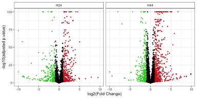

# E93 and br RNAseq
Luis P Iniguez

## Mappings

Scripts for analyzing RNA-seq samples:

Each samples were mapped to dm6 transcriptome (ensemble release 104)
with Salmon.

``` bash
salmon index -t [dm6_transcriptome.fa] -i [TRANSCRIPTOME INDEX] -k 29
salmon quant -l A -i [TRANSCRIPTOME INDEX] -r [Sample.fastq] 
         -o [OutputDir] --seqBias --gcBias 

#
# Salmon outputs were integrated with tximport package
#
```

## Analysis

Setup:

``` r
library(dplyr)
library(data.table)
library(stringr)
library(tidyr)
library(ggplot2)
library(org.Dm.eg.db)
library(TxDb.Dmelanogaster.UCSC.dm6.ensGene)
library(BSgenome.Dmelanogaster.UCSC.dm6)
library(PCAtools)
library(DESeq2)
library(IHW)
library(ReMapEnrich) 
library(GenomicRanges)

library(ggpubr)
library(cowplot)
library(ggh4x)

library(ComplexHeatmap)


library(MotifDb)
library(motifmatchr)
library(seqLogo)
library("universalmotif")
```

Read Data:

``` r
coldata<-fread("Scripts_Cruz_etal_2024_files/samples_PE.txt") %>% dplyr::select(SampleName,Time,Genotype)
gcount<-fread("Scripts_Cruz_etal_2024_files/Salmon_Gene_table_counts.csv") %>%  dplyr::select("V1",coldata$SampleName)
gtpm<-fread("Scripts_Cruz_etal_2024_files/Salmon_Gene_table_TPM.csv") %>%  dplyr::select("V1",coldata$SampleName)
```

Color definitions:

``` r
coldata$GRP<-paste0(coldata$Genotype,"_",coldata$Time)
coldata$Counts<-colSums(gcount[,-1])
colorList<-list("Genotype"=c("Cont"="#4477AA","EP93"="#EE442F","EP93_Broad"="#6da02c"), 
                "GRP"=c("Cont_H24"="#A6CEE3", "Cont_H44"="#1F78B4",
                        "EP93_H24"="#FB9A99", "EP93_H44"="#E31A1C", 
                        "EP93_Broad_H24"="#B2DF8A", "EP93_Broad_H44"="#33A02C"),
                "RI"=c("NotSensitive"="gray","Rescued"="#00b2b2", "Overreacted"="#b20000"))

col_fun_zscore<-circlize::colorRamp2(seq(-2,2,length.out = 11),  rev(paletteer::paletteer_d("MoMAColors::Avedon")))

geneName <- ensembldb::select(org.Dm.eg.db, keys= gcount$V1,
                              keytype = "ENSEMBL", columns = c("ENSEMBL","SYMBOL","ENTREZID")) %>%
  as_tibble() %>% mutate(SYMBOL=ifelse(is.na(SYMBOL),ENSEMBL,SYMBOL))
```

Usefull functions:

``` r
get_promoter_sequence <- function(gene,start, end, strand, chr, upstream=1000, downstream=200) {
  if(strand == "+") { # Positive strand
    promoter_start <- max(start - upstream, 1)
    promoter_end <- start + downstream
  } else { # Negative strand
    promoter_start <- end - downstream
    promoter_end <- min(end + upstream, seqlengths(BSgenome.Dmelanogaster.UCSC.dm6)[chr])
  }
  c(gene,chr,promoter_start, promoter_end)
}

checkTFBS_enrich<-function(genes2check, motifs2check=motifs2check, probs){
      resMotifscan<-matchMotifs(motifs2check,subject = promoters[genes2check],
                                genome="BSgenome.Dmelanogaster.UCSC.dm6", out = 'scores')
      ids<-sapply(motifs2check,function(x)x@ID)
      matches<-colSums(assay(resMotifscan,"motifMatches") %>% as.matrix())
      pvalues<-sapply(1:length(motifs2check), function(x){
        binom.test(matches[x],length(genes2check),p=probs[ids[x]],alternative = "t")$p.value
      })
      tibble("TFBS"=ids) %>%
        mutate("matches"= colSums(assay(resMotifscan,"motifMatches") %>% as.matrix()), 
               "Expected"=probs[ids]*length(genes2check),
               "p.value"=pvalues) %>% return()
}
```

Get promoters

``` r
gene_info <- genes(TxDb.Dmelanogaster.UCSC.dm6.ensGene, columns = c("tx_name"), filter = list(gene_id = geneName$ENSEMBL))
promoters <- mapply(get_promoter_sequence,
                    gene=names(gene_info),
                    start = start(gene_info), 
                    end = end(gene_info), 
                    strand = as.character(strand(gene_info)), 
                    chr = as.character(seqnames(gene_info)),USE.NAMES = F) %>% t() %>% as.data.frame()
colnames(promoters)<-c("Gene", "Chr","Start","End")
promoters<-GRanges(seqnames = promoters$Chr,ranges=IRanges(start=as.numeric(promoters$Start),
                                                           end=as.numeric(promoters$End),names=promoters$Gene))
```

Filter Genes

``` r
minreppergroup<-3
minTPM<-1
logic_mat2<-gtpm[,-1]>=minTPM
genes2analyze_tpms<-logic_mat2%>%as_tibble()%>% mutate("gene"=gtpm$V1) %>%
  pivot_longer(-gene, names_to = "sample", values_to = "expressed")%>%
  filter(expressed)%>%
  left_join(coldata[,c("SampleName","GRP")], by=c("sample"="SampleName")) %>%
  group_by(gene,GRP)%>%
  reframe(N=n())%>%
  filter(N>=minreppergroup) %>% .$gene %>% unique()
minreppergroup<-3
minreads<-10
logic_mat<-gcount[,-1]>=minreads
genes2analyze_counts<-logic_mat%>%as_tibble()%>% mutate("gene"=gtpm$V1) %>%
  pivot_longer(-gene, names_to = "sample", values_to = "expressed")%>%
  filter(expressed)%>%
  left_join(coldata[,c("SampleName","GRP")], by=c("sample"="SampleName")) %>%
  group_by(gene,GRP)%>%
  reframe(N=n())%>%
  filter(N>=minreppergroup) %>%
  .$gene %>% unique()
genes2analyze<-base::intersect(genes2analyze_tpms,genes2analyze_counts)
```

Normalization:

``` r
counts_filtered<-gcount %>% filter(V1 %in% genes2analyze) %>% tibble::column_to_rownames("V1") %>% as.matrix
dds<-DESeqDataSetFromMatrix(counts_filtered,
                            colData = data.frame(coldata,row.names  =coldata$SampleName),
                            design = ~GRP)
dds$GRP<-relevel(dds$GRP,ref = "Cont_H24")
dds_grps<-DESeq(dds) #Classical DESeq2 test

vsd_obj<-vst(dds_grps) %>% assay()
tmp<-vsd_obj %>% as_tibble(rownames="ENSEMBL") %>% left_join(geneName,by="ENSEMBL")
tmp$SYMBOL[is.na(tmp$SYMBOL)] <- tmp$ENSEMBL[is.na(tmp$SYMBOL)]
vst4plts<-tmp %>% pivot_longer(-c(ENSEMBL,SYMBOL,ENTREZID),
                               names_to = "Sample",values_to = "Expr") %>%
          left_join(coldata, by=c("Sample"="SampleName"))%>%
          mutate(GRP=factor(GRP,levels=c("Cont_H24","Cont_H44",
                                         "EP93_H24","EP93_H44","EP93_Broad_H24","EP93_Broad_H44")))
```

PCA:

``` r
mat2PCA<-vst(dds_grps) %>% assay()
p <- pca(mat2PCA,metadata = data.frame(coldata,row.names  =coldata$SampleName))
# biplot(p,colby = "Genotype", shape="Time",x = 'PC1', y='PC2',encircle = TRUE) +
#   scale_color_manual(values = colorList$Genotype)+
#   scale_fill_manual(values = colorList$Genotype)
# biplot(p,colby = "Counts",x = 'PC1', y='PC2') 
biplot(p,colby = "Genotype", shape="Time",x = 'PC1', y='PC2',encircle = TRUE) +
  scale_color_manual(values = colorList$Genotype)+
  scale_fill_manual(values = colorList$Genotype)
```


Normalized Genes:

``` r
gofi<-c("Eip93F", "br")
vst4plts %>% filter(SYMBOL%in% gofi) %>%
  mutate(SYMBOL=factor(SYMBOL,levels=gofi))%>%
  ggplot(aes(x=GRP, y=Expr))+
  geom_boxplot(outlier.shape = NA, aes(fill=GRP), alpha=0.75)+
  geom_jitter(color="gray50", height = 0, width = 0.2, size=1)+
  scale_fill_manual(values = colorList$GRP, name="Groups")+
  facet_grid(SYMBOL~Time, scales = "free")+
  theme_bw()+
  theme(axis.text.x = element_blank(), axis.title.x=element_blank())
```


Comparisons:

``` r
lH24<-list("EP93"=c("EP93_H24","Cont_H24"),
           "Broad"=c("EP93_Broad_H24","Cont_H24"))
lH44<-list("EP93"=c("EP93_H44","Cont_H44"),
           "Broad"=c("EP93_Broad_H44","Cont_H44"))

res_H24<-lapply(lH24,function(x,grp="GRP"){
  res_allcomp<-results(dds_grps,contrast = c(grp, x[1],x[2]),filterFun = ihw)
  res_allcomp_Shrink<-lfcShrink(dds_grps, res =res_allcomp,
                                coef = paste0(grp,"_",x[1],"_vs_",x[2]), type="apeglm")%>%
    as_tibble(rownames="GENE")%>%mutate(Comp=paste0(x[1],"-",x[2]),
                                        oldlog2FC=res_allcomp$log2FoldChange, stat=res_allcomp$stat)
  return(res_allcomp_Shrink)
})
dds_grps$GRP<-relevel(dds_grps$GRP,ref = "Cont_H44")
dds_grps<-DESeq(dds_grps) #Classical DESeq2 test
res_H44<-lapply(lH44,function(x,grp="GRP"){
  res_allcomp<-results(dds_grps,contrast = c(grp, x[1],x[2]),filterFun = ihw)
  res_allcomp_Shrink<-lfcShrink(dds_grps, res =res_allcomp,
                                coef = paste0(grp,"_",x[1],"_vs_",x[2]), type="apeglm")%>%
    as_tibble(rownames="GENE")%>%mutate(Comp=paste0(x[1],"-",x[2]),
                                        oldlog2FC=res_allcomp$log2FoldChange, stat=res_allcomp$stat)
  return(res_allcomp_Shrink)
})
```

Volcanos:

``` r
temp_Volc_24<- res_H24$EP93 %>% mutate(Sig=ifelse(padj<0.1 & log2FoldChange>1, "Pos",
                                                  ifelse(padj<0.1 & log2FoldChange< -1, "Neg","NS")), Time="H24")%>%
  mutate(padj=ifelse(log10(padj)< -100, 10^-100,padj), 
         log2FoldChange=ifelse(log2FoldChange< -10, -10, 
                               ifelse(log2FoldChange> 10, 10, log2FoldChange)))
temp_Volc_44<- res_H44$EP93 %>% mutate(Sig=ifelse(padj<0.1 & log2FoldChange>1, "Pos",
                                                  ifelse(padj<0.1 & log2FoldChange< -1, "Neg","NS")), Time="H44")%>%
  mutate(padj=ifelse(log10(padj)< -100, 10^-100,padj), 
         log2FoldChange=ifelse(log2FoldChange< -10, -10, 
                               ifelse(log2FoldChange> 10, 10, log2FoldChange)))

volcanos<-temp_Volc_24 %>% add_row(temp_Volc_44) %>%
  ggplot(aes(x=log2FoldChange, y=-log10(padj)))+
  geom_point(aes(color=Sig), size=0.01)+
  scale_color_manual(values=c("Neg"="#26ce26","NS"="black", "Pos"="#ce2626"))+
  theme_bw(6)+
  facet_grid(~Time)+labs(y="-log10(adjusted p.value)", x="log2(Fold Change)")+
  theme(legend.position = "none", strip.background.x = element_rect(fill=NA,color="black"))
ggsave("volcanos.pdf",volcanos,width = 8.5,height = 4, units = "cm",dpi = 600)
volcanos
```



DEG tables:

``` r
res_H24$EP93 %>% left_join(res_H24$Broad, by=c("GENE","baseMean"),suffix=c("_EP93","_EP93_Broad"))%>%
  dplyr::select(!matches(c("oldlog","Comp","stat"))) %>%
  mutate("rescueIndex"=(log2FoldChange_EP93_Broad/log2FoldChange_EP93)) %>%
  left_join(geneName, by=c("GENE"="ENSEMBL"))%>%
  #write.table("Results_h24.tab", quote=F,sep="\t", row.names = F)
  openxlsx::write.xlsx(., "Results_h24.xlsx")

res_H44$EP93 %>% left_join(res_H44$Broad, by=c("GENE","baseMean"),suffix=c("_EP93","_EP93_Broad"))%>%
  dplyr::select(!matches(c("oldlog","Comp","stat"))) %>%
  mutate("rescueIndex"=(log2FoldChange_EP93_Broad/log2FoldChange_EP93)) %>%
  left_join(geneName, by=c("GENE"="ENSEMBL"))%>%
  #write.table("Results_h44.tab", quote=F,sep="\t", row.names = F)
  openxlsx::write.xlsx(., "Results_h44.xlsx")


deg24_ep93<-res_H24$EP93 %>% filter(padj<0.1 & abs(log2FoldChange)>1) %>% .$GENE
deg44_ep93<-res_H44$EP93 %>% filter(padj<0.1 & abs(log2FoldChange)>1) %>% .$GENE
```

Rescue Index:

``` r
Rescue_Index_h24<-lapply(res_H24, function(x) x%>% filter(GENE %in% deg24_ep93)) %>%
  do.call(rbind,.) %>% 
  pivot_wider(id_cols = GENE,names_from = "Comp", values_from = "log2FoldChange") %>%
  mutate(rindex=(`EP93_Broad_H24-Cont_H24`/`EP93_H24-Cont_H24`), 
         rindex=ifelse(rindex>2.5,2.5,
                       ifelse(rindex< -2.5,2.5, rindex)))%>%
  #left_join(geneName,by=c("GENE"="ENSEMBL"))%>%
  mutate(Time="H24", sign_E93=sign(`EP93_H24-Cont_H24`),
         direction_E93=ifelse(sign_E93==1,"Pos","Neg"),
         direction_E93=factor(direction_E93,levels=c("Neg","Pos")),
         "ep93vsCtr"=`EP93_H24-Cont_H24`,
         "ep93_brvsCtr"=`EP93_Broad_H24-Cont_H24`)

Rescue_Index_h44<-lapply(res_H44, function(x) x%>% filter(GENE %in% deg44_ep93)) %>%
  do.call(rbind,.) %>% 
  pivot_wider(id_cols = GENE,names_from = "Comp", values_from = "log2FoldChange") %>%
  mutate(rindex=(`EP93_Broad_H44-Cont_H44`/`EP93_H44-Cont_H44`), 
         rindex=ifelse(rindex>2.5,2.5,
                       ifelse(rindex< -2.5,2.5, rindex)))%>%
  #left_join(geneName,by=c("GENE"="ENSEMBL"))%>%
  mutate(Time="H44",sign_E93=sign(`EP93_H44-Cont_H44`),
         direction_E93=ifelse(sign_E93==1,"Pos","Neg"),
         direction_E93=factor(direction_E93,levels=c("Neg","Pos")),
         "ep93vsCtr"=`EP93_H44-Cont_H44`,
         "ep93_brvsCtr"=`EP93_Broad_H44-Cont_H44`)
```

Heatmaps:

``` r
temp<-Rescue_Index_h24 %>% filter(GENE %in% deg24_ep93)%>%
  arrange(direction_E93,rindex) %>%
  mutate(Rclass=ifelse(rindex> -0.25 & rindex< 0.75,
                       "Rescued",
                       ifelse(rindex> 0.75 & rindex< 1.5 ,"NotSensitive","Overreacted")))

mat2heatmap<-vst4plts %>% filter(ENSEMBL %in% deg24_ep93 & Time=="H24") %>%
  dplyr::select(ENSEMBL,Sample,Expr)%>% unique() %>%
  pivot_wider(id_cols = "ENSEMBL", names_from = "Sample", values_from = "Expr") %>%
  tibble::column_to_rownames("ENSEMBL") %>% as.matrix()


mat2heatmap<-mat2heatmap[Rescue_Index_h24 %>% arrange(direction_E93,rindex)%>% filter(GENE %in% deg24_ep93) %>% .$GENE, ]
mat2heatmap <- t(scale(t(mat2heatmap)))

tempcd<-coldata %>% filter(SampleName %in% colnames(mat2heatmap)) %>%
  mutate(SampleName=factor(SampleName, levels=colnames(mat2heatmap))) %>% arrange(SampleName)
ha = rowAnnotation(RI = temp %>% arrange(direction_E93,rindex) %>% .$Rclass, col = list(RI = colorList$RI))
Ta = HeatmapAnnotation(GRP = forcats::fct_inorder( tempcd$GRP),
                       col=colorList)
heatmapH24<-Heatmap(mat2heatmap, name = "Z-score", col = col_fun_zscore, show_row_names = F,cluster_rows =F, #left_annotation = ha,
         cluster_columns = F, left_annotation = ha, top_annotation = Ta, show_column_names = F)

temp<-Rescue_Index_h44 %>% filter(GENE %in% deg44_ep93) %>%
  arrange(direction_E93,rindex) %>%
  mutate(Rclass=ifelse(rindex> -0.25 & rindex< 0.75,
                       "Rescued",
                       ifelse(rindex> 0.75 & rindex< 1.5 ,"NotSensitive","Overreacted")))

mat2heatmap<-vst4plts %>% filter(ENSEMBL %in% deg44_ep93 & Time=="H44") %>%
  dplyr::select(ENSEMBL,Sample,Expr)%>% unique() %>%
  pivot_wider(id_cols = "ENSEMBL", names_from = "Sample", values_from = "Expr") %>%
  tibble::column_to_rownames("ENSEMBL") %>% as.matrix()


mat2heatmap<-mat2heatmap[Rescue_Index_h44 %>% filter(GENE %in% deg44_ep93) %>% arrange(direction_E93,rindex) %>% .$GENE, ]
mat2heatmap <- t(scale(t(mat2heatmap)))
tempcd<-coldata %>% filter(SampleName %in% colnames(mat2heatmap)) %>%
  mutate(SampleName=factor(SampleName, levels=colnames(mat2heatmap))) %>% arrange(SampleName)
ha = rowAnnotation(RI = temp %>% arrange(direction_E93,rindex) %>% .$Rclass, col = list(RI = colorList$RI))
Ta = HeatmapAnnotation(GRP = forcats::fct_inorder( tempcd$GRP),
                       col=colorList)
heatmapH44<-Heatmap(mat2heatmap, name = "Z-score", col = col_fun_zscore, show_row_names = F,cluster_rows =F, #left_annotation = ha,
                    cluster_columns = F, left_annotation = ha, top_annotation = Ta, show_column_names = F)
heatmapH24 %v% heatmapH44
```


``` r
pdf("Heatmap_24.pdf", width = 6,height =4 )
heatmapH24
dev.off()
```

    quartz_off_screen 
                    2 

``` r
pdf("Heatmap_44.pdf", width = 6,height =4 )
heatmapH44
dev.off()
```

    quartz_off_screen 
                    2 

Scatter plots:

``` r
scatters<-Rescue_Index_h24[,c("ep93vsCtr","ep93_brvsCtr","rindex","Time")] %>%
  add_row(Rescue_Index_h44[,c("ep93vsCtr","ep93_brvsCtr","rindex","Time")])%>%
  ggplot(aes(x=`ep93vsCtr`, y=`ep93_brvsCtr`))+
  geom_vline(xintercept = 0, color="gray30",linewidth=0.1)+geom_hline(yintercept = 0, color="gray30",linewidth=0.1)+
  geom_point( aes(color=rindex), stroke=0,size=0.5)+
  geom_abline(slope = 1,intercept = 0, linetype="dashed", color="black",linewidth=0.1)+
  scale_color_gradientn(colours = c("#b20000","#00b2b2","gray","#b20000"),  lim=c(-1.5,2.5), name="Rescue Index")+
  guides(fill=guide_colorbar(barheight = 0.25))+
  theme_bw(6)+
  facet_grid(~Time)+
  theme(legend.position = "bottom", strip.background.x = element_rect(fill=NA,color="black"))
ggsave("scatters.pdf",scatters,width = 8.5,height = 5, units = "cm",dpi = 600)  
scatters
```


``` r
volc_scat<-cowplot::plot_grid(volcanos,scatters+theme(legend.position = "none"),ncol=1,align = "v", rel_heights = c(1,1))
volc_scat<-cowplot::plot_grid(volc_scat,get_legend(scatters),ncol=1,rel_heights = c(1,0.05))
ggsave("volc_scat.pdf",volc_scat,width = 8.5,height = 9, units = "cm",dpi = 600)  
```

Density plots:

``` r
hist24<-Rescue_Index_h24 %>% #filter(GENE %in% deg24_ep93)%>%
  ggplot(aes(x=rindex))+
  annotate("rect",xmin=-0.25,xmax=0.75, ymin=0, ymax=Inf, fill="#00b2b2", alpha=0.35)+
  annotate("rect",xmin=0.75,xmax=1.5, ymin=0, ymax=Inf, fill="gray", alpha=0.35)+
  annotate("rect",xmin=-Inf,xmax=-0.25, ymin=0, ymax=Inf, fill="#b20000", alpha=0.35)+
  annotate("rect",xmin=1.5,xmax=Inf, ymin=0, ymax=Inf, fill="#b20000", alpha=0.35)+
  geom_histogram(fill="white", bins = 100, color="gray20")+
  labs(y="Counts",x="Rescue Index")+
  ggtitle("H24")+
  theme_cowplot()
dens24<-ggdensity(
  Rescue_Index_h24, #%>% filter(GENE %in% deg24_ep93),
  x = "rindex", 
  color = "black", alpha = 0)+
  scale_y_continuous( position = "right")  +
  theme_half_open() +
  labs(y="Density")+
  rremove("x.axis")+
  rremove("xlab") +
  rremove("x.text") +
  rremove("x.ticks") +
  rremove("legend")
aligned_plots <- align_plots(hist24, dens24, align="hv", axis="tblr")
ggdraw(aligned_plots[[1]]) + draw_plot(aligned_plots[[2]])
```


``` r
hist44<-Rescue_Index_h44 %>% #filter(GENE %in% deg44_ep93)%>%
  ggplot(aes(x=rindex))+
  annotate("rect",xmin=-0.25,xmax=0.75, ymin=0, ymax=Inf, fill="#00b2b2", alpha=0.35)+
  annotate("rect",xmin=0.75,xmax=1.5, ymin=0, ymax=Inf, fill="gray", alpha=0.35)+
  annotate("rect",xmin=-Inf,xmax=-0.25, ymin=0, ymax=Inf, fill="#b20000", alpha=0.35)+
  annotate("rect",xmin=1.5,xmax=Inf, ymin=0, ymax=Inf, fill="#b20000", alpha=0.35)+
  geom_histogram(fill="white", bins = 100, color="gray20")+
  labs(y="Counts",x="Rescue Index")+
  ggtitle("H44")+
  theme_cowplot()
dens44<-ggdensity(
  Rescue_Index_h44, #%>% filter(GENE %in% deg44_ep93),
  x = "rindex", 
  color = "black", alpha = 0)+
  scale_y_continuous( position = "right")  +
  theme_half_open() +
  labs(y="Density")+
  rremove("x.axis")+
  rremove("xlab") +
  rremove("x.text") +
  rremove("x.ticks") +
  rremove("legend")
aligned_plots <- align_plots(hist44, dens44, align="hv", axis="tblr")
ggdraw(aligned_plots[[1]]) + draw_plot(aligned_plots[[2]])
```


Bar plots:

``` r
bar_percentage<-Rescue_Index_h24[,c("GENE","rindex","Time", "direction_E93")]%>% #filter(GENE %in% deg24_ep93)%>%
  rbind(Rescue_Index_h44[,c("GENE","rindex","Time", "direction_E93")] ) %>%#%>% filter(GENE %in% deg44_ep93))%>%
  mutate(rindexBIN=ifelse(rindex> -0.25 & rindex< 0.75,
                          "Rescued",
                          ifelse(rindex >= 0.75 & rindex <= 1.5 ,"NotSensitive","Overreacted")))%>%
  mutate(rindexBIN=factor(rindexBIN, levels=c("NotSensitive","Overreacted","Rescued")))%>%
  group_by(rindexBIN,Time)%>% reframe(N=n())%>%arrange(rindexBIN)%>%
  group_by(Time)%>%reframe(rindexBIN, N,P=(N*100/sum(N)) ,P_text=paste0(round(N*100/sum(N),2),"%"))%>%
  ggplot(aes(x=Time,y=P, fill=rindexBIN))+
  geom_bar(stat="identity", color="black",linewidth=0.25)+
  geom_text(aes(label = N), size= 2, position = position_stack(vjust = 0.5),colour = "white")+
  scale_fill_manual(values=colorList$RI, name="GeneGroups")+
  labs(y="Percentage")+
  theme_bw(6)+
  scale_y_continuous(breaks = seq(0,100,20), labels = paste0(seq(0,100,20),"%"))+
  theme(axis.title = element_blank())

ggsave("bar_percentage.pdf",bar_percentage,device = "pdf",height = 4.5,width = 4,units = "cm",dpi = 300) 
bar_percentage
```


## Motif Aanalysis

``` r
motifs2check<-query(MotifDb, orStrings = c("FBgn0013948","FBgn0000210"), "Fly")
motifs2check<-convert_motifs(motifs2check, class="TFBSTools-PFMatrix")
motifs2check<-do.call(TFBSTools::PFMatrixList, motifs2check)

motifsDme<-query(MotifDb,  "Fly")
motifsDme<-convert_motifs(motifsDme, class="TFBSTools-PFMatrix")
motifsDme<-do.call(TFBSTools::PFMatrixList, motifsDme)
```

Background:

``` r
matched_rand_Seq_allDBP<-sapply(1:10,function(x){
  set.seed(15102024+x)
  randomgenes<-sample(names(promoters),size = 1000)
  resMotifscan_rand<-matchMotifs(motifsDme,subject = promoters[randomgenes],
                                 genome="BSgenome.Dmelanogaster.UCSC.dm6", out = 'scores')
  colSums(assay(resMotifscan_rand,"motifMatches") %>% as.matrix())
})%>% t() 
allmotifProbs<-colSums(matched_rand_Seq_allDBP)/(1000*10)
names(allmotifProbs)<-sapply(motifsDme,function(x)x@ID)
```

GeneLists:

``` r
rescuedGenes_h24_4tfbsanal<-Rescue_Index_h24 %>% filter(rindex> -0.25 & rindex< 0.75 & GENE %in% names(promoters)) 
notsensitive_h24_4tfbsanal<-Rescue_Index_h24 %>% filter(rindex> 0.5 & rindex< 1.5 & GENE %in% names(promoters))
overreacte_h24_4tfbsanal<-Rescue_Index_h24 %>% filter(rindex< -0.5 | rindex> 1.5 & GENE %in% names(promoters))
rescuedGenes_h44_4tfbsanal<-Rescue_Index_h44 %>% filter(rindex> -0.25 & rindex< 0.75 & GENE %in% names(promoters))
notsensitive_h44_4tfbsanal<-Rescue_Index_h44 %>% filter(rindex> 0.5 & rindex< 1.5 & GENE %in% names(promoters))
overreacte_h44_4tfbsanal<-Rescue_Index_h44 %>% filter(rindex< -0.5 | rindex> 1.5 & GENE %in% names(promoters))
list_genes<-list("Rescue_24"=rescuedGenes_h24_4tfbsanal$GENE,
                 "Rescue_44"=rescuedGenes_h44_4tfbsanal$GENE,
                 "notsensitive_24"=notsensitive_h24_4tfbsanal$GENE,
                 "notsensitive_44"=notsensitive_h44_4tfbsanal$GENE,
                 "overreacted_24"=overreacte_h24_4tfbsanal$GENE,
                 "overreacted_44"=overreacte_h44_4tfbsanal$GENE)
```

Testing br and E93 motifs:

``` r
Matches_all<-lapply(list_genes, function(x){
  resMotifscan<-matchMotifs(motifsDme,subject = promoters[x],
                            genome="BSgenome.Dmelanogaster.UCSC.dm6", out = 'scores')
  ids<-sapply(motifsDme,function(x)x@ID)
  matches<-assay(resMotifscan,"motifCounts") %>% as.matrix() 
  colnames(matches)<-ids
  return(matches)
})
```

Pie charts:

``` r
propr_TFBS<-lapply(Matches_all,function(x) x %>% as_tibble(rownames="gene")) %>% purrr::list_rbind( names_to = "Type") %>% 
  filter(!grepl("pos|neg",Type,perl=T))%>%
   dplyr::select(Type,gene,matches("FBgn0013948|FBgn0000210", perl=T)) %>%
  pivot_longer(-c(Type,gene),names_to = "TFBS",values_to = "Matches")%>%
  mutate(Class=sapply(strsplit(Type,'_'),'[[',1),
         Class=factor(Class,levels=c("overreacted", "notsensitive","Rescue")),
         Time=ifelse(grepl("24",Type),"H24","H44"),
         TF=ifelse(grepl("FBgn0000210",TFBS),"br","E93")) %>% filter(Class=="Rescue")%>%
  group_by(Type,gene,Class,Time,TF) %>%reframe(minMatches=sum(Matches>0)>0) %>%
  pivot_wider(id_cols = c(Type,gene,Class,Time), names_from = "TF", values_from = "minMatches")%>%
  mutate(GeneGroups=ifelse(E93&br,"br & E93",
                           ifelse(E93,"E93",
                                  ifelse(br,"br","none"))),
         GeneGroups=factor(GeneGroups,levels=c("br","br & E93","E93","none")))%>%
  group_by(Type,Time,Class,GeneGroups) %>%
  reframe(N=n())%>%
  group_by(Time,Type,Class)%>%reframe(GeneGroups, N,P=(N*100/sum(N)) ,P_text=paste0(round(N*100/sum(N),2),"%"))%>%
  ggplot(aes(x="",y=P, fill=GeneGroups))+
  geom_bar(stat="identity", width = 1, color="black", linewidth=0.1)+
  geom_text(aes(label = N), size= 2, position = position_stack(vjust = 0.5),colour = "black")+
  scale_fill_manual(values=c("br & E93"="#FD0C81FF","br"="#FFED4DFF","E93"="#C34582FF","none"="gray80"), name="GeneGroups")+
  coord_polar(theta = "y", start = 0)+
  facet_wrap(~Time,ncol = 1)+
  labs(y="Percentage")+
  theme_bw(6)+
  theme(axis.text = element_blank(), legend.position = "left",panel.grid =element_blank(),
        axis.ticks = element_blank(), strip.background.x = element_rect(fill=NA,color="black"),
        axis.title = element_blank(),)

ggsave("propr_TFBS.pdf",propr_TFBS,units="cm",height = 4, width = 6)
```

Pie charts 2:

``` r
lapply(Matches_all,function(x) x %>% as_tibble(rownames="gene")) %>% purrr::list_rbind( names_to = "Type") %>% 
   dplyr::select(Type,gene,matches("FBgn0013948|FBgn0000210", perl=T)) %>%
  pivot_longer(-c(Type,gene),names_to = "TFBS",values_to = "Matches")%>%
  mutate(Class=sapply(strsplit(Type,'_'),'[[',1),
         Class=factor(Class,levels=c("overreacted", "notsensitive","Rescue")),
         Time=ifelse(grepl("24",Type),"H24","H44"),
         TF=ifelse(grepl("FBgn0000210",TFBS),"br","E93")) %>% 
  group_by(Type,gene,Class,Time,TF) %>%reframe(minMatches=sum(Matches>0)>0) %>%
  pivot_wider(id_cols = c(Type,gene,Class,Time), names_from = "TF", values_from = "minMatches")%>%
  mutate(GeneGroups=ifelse(E93&br,"br & E93",
                           ifelse(E93,"E93",
                                  ifelse(br,"br","none"))),
         GeneGroups=factor(GeneGroups,levels=c("br","br & E93","E93","none")))%>%
  group_by(Type,Time,Class,GeneGroups) %>%
  reframe(N=n())%>%
  group_by(Time,Type,Class)%>%reframe(GeneGroups, N,P=(N*100/sum(N)) ,P_text=paste0(round(N*100/sum(N),2),"%"))%>%
  ggplot(aes(x="",y=P, fill=GeneGroups))+
  geom_bar(stat="identity", width = 1, color="black", linewidth=0.1)+
  geom_text(aes(label = N), size= 2, position = position_stack(vjust = 0.5),colour = "black")+
  scale_fill_manual(values=c("br & E93"="#FD0C81FF","br"="#FFED4DFF","E93"="#C34582FF","none"="gray80"), name="GeneGroups")+
  coord_polar(theta = "y", start = 0)+
  facet_nested(Time~Class)+
  labs(y="Percentage")+
  theme_bw(6)+
  theme(axis.text = element_blank(), legend.position = "left",panel.grid =element_blank(),
        axis.ticks = element_blank(), strip.background.x = element_rect(fill=NA,color="black"),
        axis.title = element_blank())
```


Enrichment:

``` r
res_enrich_ALL_TFBS<-lapply(list_genes,checkTFBS_enrich,motifs2check = motifsDme,probs=allmotifProbs)
```

``` r
enrichment_tfbs<-purrr::list_rbind(res_enrich_ALL_TFBS, names_to = "Type") %>% filter(!grepl("pos|neg",Type,perl=T))%>%
  filter(grepl("FBgn0013948|FBgn0000210",TFBS, perl=T))%>%
  mutate(Class=sapply(strsplit(Type,'_'),'[[',1),
         Class=factor(Class,levels=rev(c("overreacted", "notsensitive","Rescue"))),
         Time=ifelse(grepl("24",Type),"H24","H44"),
         Dir=ifelse(grepl("pos",Type),"Pos","Neg"), 
         sigifi=ifelse(matches>Expected,"Enriched","Depleted"), 
         propChange=abs((matches-Expected))/Expected) %>% filter(Class=="Rescue")%>%
   filter(p.value<0.1 )%>%
  # filter(matches>10)%>%
  ggplot(aes(x=Class, y=TFBS))+
    geom_point(aes( color=-log10(p.value)), size=4)+
  facet_nested(~Time)+
  scale_color_viridis_c(direction = -1, lim=c(1,15))+
  theme_bw(6)+
  theme(axis.text.x=element_blank(), strip.background.x = element_rect(fill=NA,color="black"), 
        axis.title = element_blank(), axis.ticks.x = element_blank())
ggsave("enrichment_tfbs.pdf",enrichment_tfbs,height = 2.5,width = 6.5, units = "cm",dpi = 300)
```

``` r
purrr::list_rbind(res_enrich_ALL_TFBS, names_to = "Type") %>% filter(!grepl("pos|neg",Type,perl=T))%>%
  filter(grepl("FBgn0013948|FBgn0000210",TFBS, perl=T))%>%
  mutate(Class=sapply(strsplit(Type,'_'),'[[',1),
         Class=factor(Class,levels=rev(c("overreacted", "notsensitive","Rescue"))),
         Time=ifelse(grepl("24",Type),"H24","H44"),
         Dir=ifelse(grepl("pos",Type),"Pos","Neg"), 
         sigifi=ifelse(matches>Expected,"Enriched","Depleted"), 
         propChange=abs((matches-Expected))/Expected) %>%
   filter(p.value<0.1 )%>%
  # filter(matches>10)%>%
  ggplot(aes(x=Class, y=TFBS))+
    geom_point(aes( color=-log10(p.value)), size=4)+
  facet_nested(~Time)+
  scale_color_viridis_c(direction = -1, lim=c(1,15))+
  theme_bw(6)+
  theme(strip.background.x = element_rect(fill=NA,color="black"), 
        axis.title = element_blank())
```


